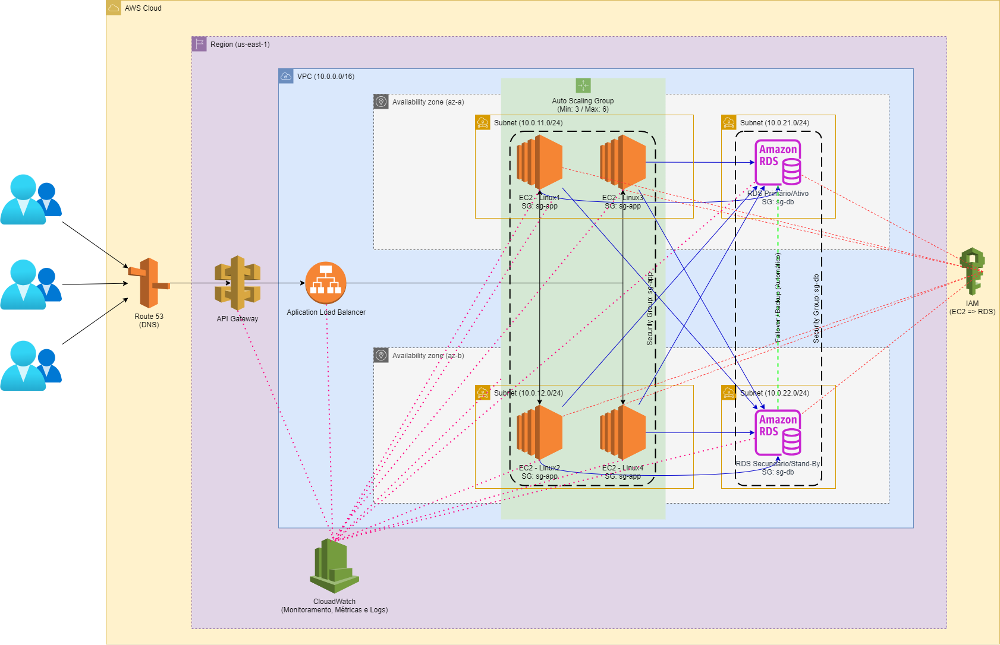

# Desenvolvimento da Solução do Desafio Final

## Escopo

Arquitetura em nuvem escalável, com alta disponibilidade e resiliência para uma aplicação de vendas online, utilizando as boas práticas de arquitetura em nuvem e observando os pontos solicitados no desafio, vide abaixo:
- Uso de múltiplas zonas de disponibilidade para garantir continuidade do serviço mesmo em caso de falha de uma zona.
- Balanceamento de carga para distribuir o tráfego entre as máquinas virtuais (VMs).
- Escalonamento automático das VMs de acordo com a demanda, com um mínimo de 3 e máximo de 6 instâncias, usando imagens Linux.
- Provisão de um serviço de banco de dados gerenciado (PaaS) que garanta alta disponibilidade e segurança para os dados da aplicação.
- Configuração de controle de acesso (IAM) para que as VMs tenham permissões de leitura e escrita no banco de dados provisionado.

## Arquivos

- PauloGusttavoTognato.drawio.png - Diagrama salvo em formato de imagem (.png)
- PauloGusttavoTognato.drawio - Diagrama editável no aplicativo [draw.io](https://www.drawio.com/).

## Diagrama

### Escolha da Região e Configuração da VPC
A arquitetura foi planejada para operar no provedor de cloud AWS, na região us-east-1, utilizando uma Virtual Private Cloud (VPC) com o bloco de endereçamento 10.0.0.0/16. Dentro dessa VPC, foram desenhadas sub-redes distribuídas entre duas zonas de disponibilidade (us-east-1a e us-east-1b), com o objetivo de garantir tolerância a falhas e continuidade dos serviços em caso de indisponibilidade regional.
### Organização das Subnets e Grupos de Segurança
Todas as subnets foram definidas como privadas, uma vez que o acesso externo à aplicação será feito por meio de um API Gateway e um Application Load Balancer (ALB), que atuam como camada de entrada e distribuem as requisições para os recursos internos.
A divisão das subnets foi pensada da seguinte forma:
•	10.0.1.0/24 e 10.0.2.0/24: destinadas às instâncias EC2 da aplicação;
•	10.0.21.0/24 e 10.0.22.0/24: reservadas para o banco de dados Amazon RDS.
Para garantir a segurança da comunicação entre os componentes, foram definidos Grupos de Segurança (Security Groups) com regras restritivas:
•	O SG da aplicação (sg-app) permite tráfego HTTP/HTTPS proveniente do Load Balancer, além de saída para a porta 3306 (MySQL) do RDS;
•	O SG do banco de dados (sg-db) permite entrada apenas a partir do SG da aplicação, garantindo que o banco só possa ser acessado pelas instâncias EC2.
### Camada de Entrada e Balanceamento de Carga
A arquitetura prevê o uso do Amazon Route 53 para resolução de nomes DNS, apontando para um API Gateway, que centraliza e protege o acesso à aplicação. O Application Load Balancer (ALB) será responsável por distribuir as requisições entre as instâncias EC2 em múltiplas zonas de disponibilidade, promovendo alta disponibilidade e balanceamento de carga.
### Estratégia de Auto Scaling
As instâncias EC2 da aplicação serão baseadas em uma imagem Linux e organizadas em um Auto Scaling Group, com capacidade de escalar dinamicamente entre 3 e 6 instâncias, conforme a variação de carga.
As métricas definidas para o escalonamento automático são o uso de CPU e memória. Quando a utilização de CPU ou memória atinge 70% ou mais, o sistema realiza um scale up, adicionando uma nova instância automaticamente para suportar o aumento da demanda. Por outro lado, quando o consumo de CPU ou memória cai para 30% ou menos, ocorre o scale down, removendo uma instância para otimizar o uso de recursos e reduzir custos.
### Banco de Dados Gerenciado
Para o armazenamento dos dados, foi desenhado o uso do Amazon RDS com o mecanismo MySQL. A arquitetura prevê uma instância principal na zona us-east-1a e uma réplica em standby na us-east-1b, garantindo alta disponibilidade e failover automático. Também estão incluídas configurações de backup automatizado e replicação entre zonas, seguindo boas práticas de continuidade e segurança.
### Controle de Acesso (IAM)
Foi planejada a criação de uma IAM Role associada às instâncias EC2, com permissões específicas para leitura e escrita no banco de dados RDS. A arquitetura segue o princípio do menor privilégio, garantindo que cada recurso tenha acesso apenas ao que é necessário para seu funcionamento.
### Monitoramento e Logs
A arquitetura inclui o uso do Amazon CloudWatch para monitoramento de métricas como CPU, memória e I/O, além da coleta de logs. O CloudWatch também é responsável por avaliar as métricas que disparam as ações de Auto Scaling, como os limites de 70% para scale up e 30% para scale down. Isso permite que o sistema reaja automaticamente às variações de carga, além de oferecer visibilidade operacional para análise de desempenho e identificação de falhas.
